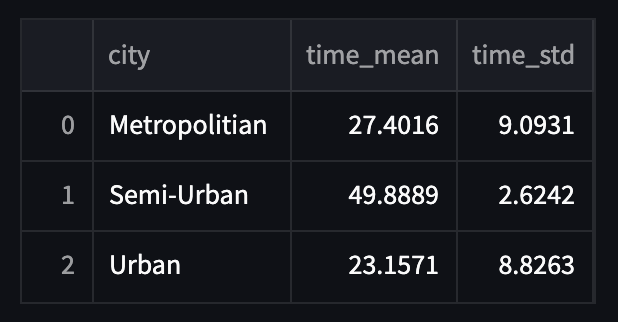

# Made in Asia Marketplace
## Visualização e análise de dados da empresa Made in Asia na plataforma do Streamlit 

# 1.0 Problema de Negócio 

Made in Asia é uma empresa que funciona como um marketplace de restaurantes na Índia. Nesse sentido, o seu objetivo é facilitar o encontro e negociações entre clientes e restaurantes.

# 2.0 Premissas de Negócio

- O modelo adotado pela empresa é o Marketplace
- Um dashboard baseado em três visões diferentes (Empresa, Entregadores e Restaurantes)foi construído para acompanhar as métricas de crescimento da empresa 

## 2.1 Descrição dos dados

| Column            | Description                                                                                                                             |
| :---------------- | :-------------------------------------------------------------------------------------------------------------------------------------- |
| `ID`       | Identificador único do cliente                                                                                                                                  |
| `Delivery_person_ID`      | Identificador único do Entregador                                                                                                                           |
| `Delivery_person_Age`         | Idade de cada Entregador                                                                                                                    |
| `Delivery_person_Ratings`     | Nota de cada entregador                                                                                                            |
| `Restaurant_latitude`       | Valor da latitude de cada restaurante                                                                                                        |
| `Restaurant_longitude`          | Valor da longitude de cada restaurante                                                                                                                      |
| `Delivery_location_latitude`             | Valor da latitude da localização de cada entregador                                                                                                                         |
| `Delivery_location_longitude`          | Valor da longitude da localização de cada entregador                                                                             |
| `Order_Date`         | Data de cada pedido                                                                                          |
| `Time_Orderd`   | Horário de cada pedido                                                                      |
| `Time_Order_picked`       | Se o cliente possui ( 1 ) cartão de crédito ou não ( 0 )
| `Weatherconditions`  | Condições do clima                                                     |
| `Road_traffic_density` | Salário anual estimado do cliente                                                                                                         |
| `Vehicle_condition`          | Condição de cada veículo em uma escala de 0 a 3
| `Type_of_order`   | Tipo de cada pedido realizado                                                                      |
| `Type_of_vehicle`       | Tipo de cada veículo
| `multiple_deliveries`  | ??                                                   |
| `Festival` | Se era período de festival ( Yes ) ou não ( No )                                                                                                         |
| `City`          | Região da cidade ? 
| `Time_taken(min)`          | Tempo para cada pedido ser entregue

# 3.0 Estratégia da Solução

# 4.0 Insights

## 4.2 Top 3 Insights

# 5.0 O produto final do projeto

Com o dashboard criado, o CEO pode agora consultar o painel via Cloud, pela plataforma Streamlit e, portanto, uma maneira mais ágil e fácil para a tomada de decisão.

O painel pode ser acessado através desse link:

# 6.0 Conclusões

# 7.0 Lições Aprendidas
- Visualização e análise de dados com bibliotecas como plotly, matplotlib e seaborn
- Cálculo de medidas como latitude e longitude por meio da biblioteca haversine
- Possibilidade de consulta ágil e profissional dos dados via Cloud Streamlit

# 8.0 Próximos Passos
- Responder a novas hipóteses de negócios para entender melhor os dados e as relações de recursos e criar novas visões para verificar novas relações entre os dados
- Aplicar técnicas de programação para melhorar o desempenho da solução criada

